# CPU vs GPU Training Implementation

This document compares the CPU and GPU implementations for the Reel Driver XGBoost model training pipeline.

## Architecture Overview


## Dependency Differences

### Base Image Dependencies

| Component | CPU | GPU |
|-----------|-----|-----|
| Base Image | `python:3.12-slim-bullseye` | `nvidia/cuda:12.4.0-runtime-ubuntu22.04` |
| Python Source | Debian packages | PPA (deadsnakes) |
| CUDA Runtime | Not included | CUDA 12.4 |
| Image Size | ~500MB | ~2.5GB |

### Environment Variables

| Variable | CPU | GPU |
|----------|-----|-----|
| `USE_GPU` | `false` (default) | `true` |
| `NVIDIA_VISIBLE_DEVICES` | Not set | `all` |
| `NVIDIA_DRIVER_CAPABILITIES` | Not set | `compute,utility` |

### Python Dependencies

Both CPU and GPU use identical Python packages. XGBoost automatically detects and uses available GPU hardware:

```toml
# Core dependencies (shared)
dependencies = [
    "xgboost>=3.0.2",      # GPU-capable when CUDA is available
    "mlflow==2.22.1",
    "polars>=1.31.0",
    "pandas>=2.3.1",
    # ... other shared dependencies
]

# Model training specific
model-training = [
    "optuna>=4.4.0",
    "scikit-learn>=1.7.0",
    # ...
]
```

## Parameter Configuration

### XGBoost Device Parameter

The GPU/CPU selection is controlled via a single parameter in `src/training/model_training.py`:

```python
# GPU configuration - set USE_GPU=true to enable CUDA acceleration
USE_GPU = os.getenv("USE_GPU", "false").lower() == "true"
DEVICE = "cuda" if USE_GPU else "cpu"

# Applied to XGBoost parameters
params = {
    'device': DEVICE,  # 'cuda' or 'cpu'
    'objective': 'binary:logistic',
    'enable_categorical': True,
    # ... hyperparameters from Optuna
}
```

## How GPU Acceleration Works

### XGBoost GPU Implementation

XGBoost uses the **GPU Histogram** algorithm (`gpu_hist`) when `device='cuda'` is specified. This fundamentally changes how tree construction works:

#### CPU Flow (Traditional)


#### GPU Flow (Parallel)


### VRAM Usage and Data Transfer

#### What Gets Loaded to VRAM

| Data | When Loaded | Size (approx) |
|------|-------------|---------------|
| Training data (X_train) | `model.fit()` call | rows × features × 4 bytes |
| Labels (y_train) | `model.fit()` call | rows × 4 bytes |
| Gradient histograms | During training | bins × features × 8 bytes |
| Tree structures | During training | Small (~KB per tree) |
| Evaluation data | If eval_set provided | Same as training |

#### Data Transfer Timeline


## Performance Analysis by Operation

### Operations That Benefit from GPU

| Operation | GPU Speedup | Notes |
|-----------|-------------|-------|
| Gradient computation | **High** | Parallelized across all samples |
| Histogram building | **High** | GPU excels at binning operations |
| Split finding | **High** | Parallel evaluation of candidates |
| Tree ensemble training | **High** | Cumulative gains per tree |

### Operations That DON'T Benefit from GPU

| Operation | Why No GPU Benefit |
|-----------|-------------------|
| Data loading (Polars/Pandas) | CPU-bound I/O operations |
| Feature engineering | Polars runs on CPU |
| Cross-validation splits | Small overhead, CPU is fine |
| Metric calculation | sklearn metrics are CPU-only |
| MLflow logging | Network I/O bound |
| Final predictions | Small dataset, transfer overhead dominates |

### Training Pipeline Breakdown

```mermaid
flowchart TB
    subgraph total["Total Training Time: ~300-400 seconds"]
        data["Data loading/prep<br/>~5 sec<br/>🔵 CPU only"]
        optuna["Optuna optimization<br/>~290 sec<br/>200 trials × 5-fold CV"]
        final["Final model training<br/>~2 sec<br/>🟢 GPU ACCELERATED"]
        mlflow["MLflow logging<br/>~5 sec<br/>🔵 CPU/Network"]
    end

    subgraph trial["Per Trial: ~1.5 sec"]
        fit["XGBoost fit<br/>~1.2 sec<br/>🟢 GPU ACCELERATED"]
        pred["Predictions<br/>~0.1 sec"]
        metrics["Metrics calc<br/>~0.2 sec<br/>🔵 CPU only"]
    end

    data --> optuna --> final --> mlflow
    optuna -.-> trial
    fit --> pred --> metrics
```




## Benchmark Results

### Local Testing (RTX 3060, ~1840 rows)

| Configuration | Total Time | XGBoost Time | Notes |
|---------------|------------|--------------|-------|
| CPU | 395.04s | ~340s | Baseline |
| GPU | 308.54s | ~260s | 22% faster overall |

### Docker Testing

| Configuration | Total Time | Notes |
|---------------|------------|-------|
| CPU Container | ~395s | Same as local |
| GPU Container | ~297s | 25% faster, cleaner CUDA env |

### Expected Production Performance (~9200 rows)

With 5x more data, GPU benefits compound:
- CPU time increases ~linearly
- GPU time increases sub-linearly (better parallelization)
- Expected speedup: **40-60%** overall

## When to Use Each

### Use GPU (Recommended for Training)

- Full hyperparameter optimization runs
- Large datasets (>5000 rows)
- Many Optuna trials (>50)
- Production training pipelines

### Use CPU (Fallback/Testing)

- CI/CD testing (GitHub Actions has no GPU)
- Local development without GPU
- Small test runs
- Inference (model serving) - CPU is fast enough

## Docker Compose Configuration

### GPU Service

```yaml
model-training-gpu:
  build:
    dockerfile: ./containerization/dockerfile.model_training_gpu
    args:
      BASE_IMAGE: training-base-gpu:latest
  deploy:
    resources:
      reservations:
        devices:
          - driver: nvidia
            count: 1
            capabilities: [gpu]
```

### CPU Service

```yaml
model-training-cpu:
  build:
    dockerfile: ./containerization/dockerfile.model_training_cpu
    args:
      BASE_IMAGE: training-base-cpu:latest
  # No GPU reservation needed
```

## Troubleshooting

### Common GPU Issues

1. **CUDA out of memory**: Reduce batch size or n_estimators
2. **GPU not detected**: Check `nvidia-smi` and Docker GPU passthrough
3. **Slow GPU performance**: Ensure data isn't being transferred repeatedly

### Verify GPU Usage

```bash
# Check GPU availability in container
nvidia-smi

# Monitor GPU during training
watch -n 1 nvidia-smi

# Verify XGBoost GPU detection
python -c "import xgboost as xgb; print(xgb.build_info())"
```

## References

- [XGBoost GPU Support](https://xgboost.readthedocs.io/en/stable/gpu/index.html)
- [NVIDIA CUDA Runtime Images](https://hub.docker.com/r/nvidia/cuda)
- [Docker GPU Support](https://docs.docker.com/config/containers/resource_constraints/#gpu)
