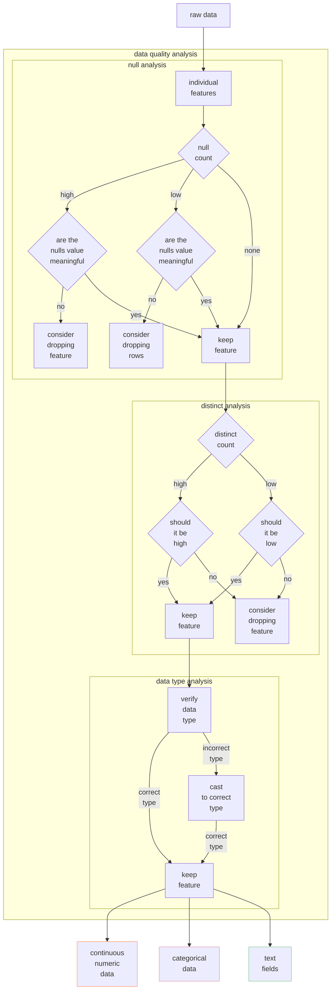
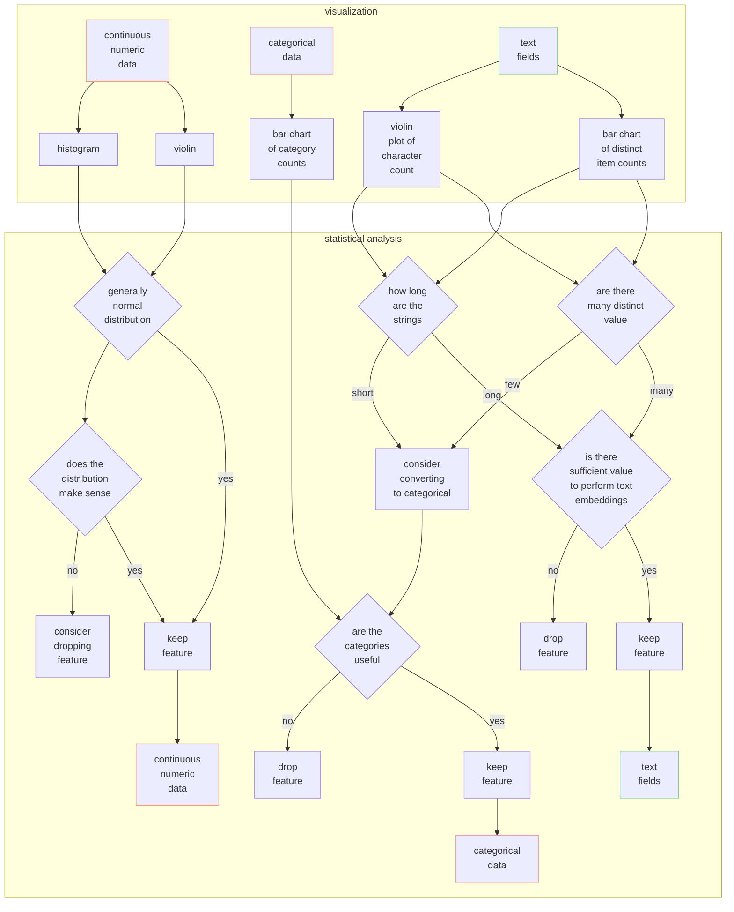
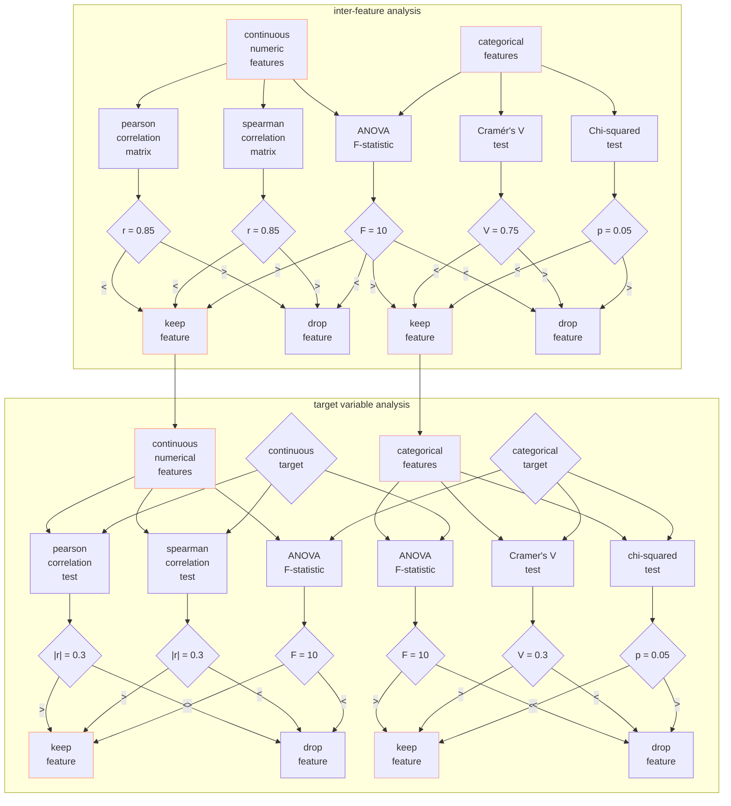
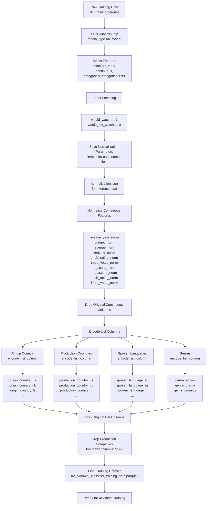

# experimental design

## problem formulation

For the initial version of this model I am going with a binomial classifier, largely because that is the type of model that will best fit my current model training data. It would be interesting to potentially try a multi-class classification problem in the future. When discussing with my wife, we have considered labeling the data as one of these possibilities: `["would-not-watch", "would watch", "would watch multiple times"]` or something analogous. This would likely decrease the probability of getting false negatives on movies we would enjoy the most by giving them their own distinct class.

## feature selection


   

   


## algorithm selection

### why XGBoost

XGBoost was selected as the primary algorithm due to its exceptional ability to handle the complex, non-linear patterns present in personal media preferences:

**Complex Feature Interactions**:
- Captures sophisticated relationships between multiple variables simultaneously
- Learns that high Rotten Tomatoes scores (>85%) + low IMDB vote counts (<1,000) = movies I won't enjoy
- Simultaneously learns that high RT scores + high vote counts (>50,000) = strong positive indicators
- Automatically discovers optimal feature combinations without manual engineering

**Conditional Logic for Genre Preferences**:
- Models genre-specific decision rules through tree branching
- Learns that comedies with low RT scores but high IMDB votes are often enjoyable
- Applies different thresholds for action movies and dramas (requiring both high RT scores and high vote counts)
- Creates separate decision paths for each genre's unique patterns

**Non-Linear Decision Boundaries**:
- Tree-based ensemble creates complex decision boundaries beyond linear separability
- Handles non-monotonic relationships (where more of a feature isn't always better)
- Separates movies I'd enjoy from those I wouldn't across multiple interacting dimensions
- Captures threshold effects and interaction terms naturally

**Language Preference Modeling**:
- Learns general preference for English-language films
- Creates exceptions for highly-rated foreign films meeting specific criteria
- Models conditional logic: IF language ≠ English AND RT score >90% AND IMDB votes >100,000 THEN predict positive
- Balances general rules with nuanced exceptions

**Second-Order Optimization**:
- Uses both first and second derivatives in optimization: `L^(t) = Σ[l(y_i, ŷ_i^(t-1)) + g_i*f_t(x_i) + (1/2)*h_i*f_t²(x_i)] + Ω(f_t)`
- Newton's method approach provides faster convergence than first-order methods
- Better handling of complex loss landscapes created by conflicting preference signals
- More stable learning when dealing with contradictory patterns in the data

**Automatic Regularization**:
- Built-in L1/L2 regularization prevents overfitting to personal quirks
- Tree pruning removes splits that don't meaningfully improve predictions
- Crucial for learning genuine patterns from limited personal training data
- Balances model complexity with generalization ability

### other models that would likely underperform

**Linear Models**:
- Completely fail to capture non-linear interactions and conditional preferences
- Cannot model scenarios where the same feature (e.g., RT score) can be both positive and negative depending on other feature values
- Miss critical threshold effects and genre-specific patterns
- Assume monotonic relationships that don't exist in personal preferences

**Logistic Regression**:
- Even with polynomial features, struggles with high-dimensional interaction space
- Requires extensive manual feature engineering to capture genre-specific rules
- Cannot efficiently model multi-way interactions between ratings, votes, and genres
- Poor handling of categorical variables like genre combinations

**Naive Bayes**:
- Strong independence assumption misses critical feature interactions
- Cannot capture the relationship between ratings and vote counts across different genres
- Fails to model conditional dependencies that drive movie preferences
- Treats each feature as independent when they clearly interact

**K-Nearest Neighbors**:
- Sensitive to curse of dimensionality with metadata features
- Doesn't generalize well to new movies with feature combinations not in training data
- No explicit model of preference patterns, just memorizes similar examples
- Poor performance with mixed categorical and continuous features

### other options that might work well

**Random Forest**:
- Strong alternative that captures non-linear relationships and feature interactions
- Provides good baseline performance with minimal tuning required
- However, XGBoost typically outperforms due to sequential error correction approach
- Less sophisticated optimization compared to gradient boosting methods

**CatBoost**:
- Another gradient boosting variant with native categorical feature handling
- Could potentially perform similarly to XGBoost on movie metadata
- Excellent with categorical features like genres and languages
- May require less preprocessing for categorical variables

**LightGBM**:
- Faster gradient boosting implementation with similar theoretical foundation
- Might achieve comparable performance with significantly reduced training time
- Potentially at the cost of some accuracy on smaller datasets like personal preferences
- Good alternative for rapid experimentation and iteration

**Neural Networks (Tabular)**:
- Modern architectures like TabNet could potentially learn complex patterns
- Deep networks might capture subtle interactions in movie preferences
- Would likely require significantly more training data than available
- Less interpretability for understanding specific preference patterns
- Overkill for structured tabular data of this size

**Support Vector Machines with RBF Kernel**:
- Could capture non-linear relationships through kernel trick
- Struggles with mixed categorical/continuous nature of movie metadata
- Doesn't provide interpretability benefits of tree-based models
- Less effective at handling the high-dimensional feature space after encoding

## feature engineering



## model hyperparameters

### class imbalance control

Class imbalance is the primary challenge with a 10:1 negative-to-positive ratio. `scale_pos_weight` directly addresses this by weighting positive examples more heavily during training. `min_child_weight` prevents unreliable predictions from small positive sample sizes by requiring sufficient instance weight in leaf nodes. `max_delta_step` provides additional imbalance protection by limiting how dramatically any single tree can adjust predictions.

### Bias vs Variance Trade-off (High Impact)

Managing model complexity involves balancing bias (underfitting) against variance (overfitting) through multiple mechanisms. `max_depth` controls how many questions each tree can ask - deeper trees capture complex interactions but risk memorizing noise. `n_estimators` sets the number of expert voters, with more trees typically improving performance until diminishing returns. `learning_rate` moderates learning aggression, requiring more trees at lower rates but achieving more stable convergence.

Regularization techniques prevent overfitting while maintaining model capacity. gamma enforces conservative tree-building by requiring meaningful loss reduction before adding complexity. `reg_alpha` applies L1 penalties that push weak feature weights toward zero, automatically removing irrelevant features. `subsample` trains each tree on random data subsets, forcing generalization while reducing computational load. `colsample_bytree` and `colsample_bylevel` add feature randomization layers that prevent overreliance on specific features. `min_child_weight` prevents unreliable predictions from small sample sizes. 

### computational efficiency vs performance

Training speed trades off with model quality primarily through `n_estimators` and `learning_rate`. More estimators with lower learning rates improve performance but extend training time. `subsample` reduces computational load by training each tree on a random data subset while providing regularization benefits that prevent overfitting.

### feature selection and regularization

Automatic feature selection occurs through multiple mechanisms. `reg_alpha` applies L1 penalties that push weak feature weights toward zero, effectively removing irrelevant features. `colsample_bytree` creates feature specialists by limiting each tree to a random feature subset. `colsample_bylevel` adds another randomization layer within tree levels for additional regularization. `enable_categorical` optimizes categorical feature handling without requiring manual tuning.

### hyperparameter grid

| Parameter | Default Value | Values Tested | Range Type | Purpose | Impact on Model | Priority | Justification |
|-----------|---------------|---------------|------------|---------|-----------------|----------|---------------|
| scale_pos_weight | 1 | [1, 5, 9, 15] | Low<br>High | Handle class imbalance | Prediction accuracy for minority class | High | Critical for 10:1 class imbalance in movie preferences; ensures model doesn't default to majority class |
| max_depth | 6 | [3, 5, 7] | Low<br>Medium<br>High | Control tree complexity | Feature interaction depth | High | Captures complex interactions (RT score + IMDB votes + genre) while preventing overfitting on limited preference data |
| n_estimators | 100 | [50, 100, 200] | Low<br>Medium<br>High | Number of boosting rounds | Model capacity and training time | High | Balances learning capacity with computational efficiency; more trees = better pattern recognition |
| min_child_weight | 1 | [1, 3, 5] | Low<br>Medium<br>High | Minimum leaf sample weight | Leaf node reliability | High | Prevents unreliable predictions from small sample sizes, critical with 10:1 class imbalance |
| learning_rate | 0.3 | [0.01, 0.1, 0.2] | Low<br>Medium<br>High | Step size for updates | Convergence speed vs accuracy | Medium | Conservative rates prevent overshooting optimal solutions for nuanced preference patterns |
| gamma | 0 | [0, 0.1, 0.2] | None<br>Low<br>Medium | Minimum split loss | Tree pruning aggressiveness | Medium | Prevents overfitting to personal quirks while maintaining genuine preference patterns |
| reg_alpha | 0 | [0, 0.01, 0.1, 1.0] | None<br>Low<br>Medium<br>High | L1 regularization | Automatic feature selection | Medium | Feature selection among movie metadata; removes irrelevant features automatically |
| subsample | 1.0 | [0.8, 1.0] | High<br>Full | Training sample fraction | Overfitting control | Medium | Regularization technique; especially important with limited personal training data |
| max_delta_step | 0 | [0, 1, 5] | None<br>Low<br>Medium | Maximum delta step | Imbalanced class handling | Low | Additional control for extreme class imbalance; secondary to scale_pos_weight |
| colsample_bytree | 1.0 | [0.8, 1.0] | High<br>Full | Feature sampling per tree | Feature selection and overfitting | Low | Secondary regularization; less critical given strong feature relevance in movie metadata |
| colsample_bylevel | 1.0 | [0.8, 1.0] | High<br>Full | Feature sampling per level | Additional regularization | Low | Tertiary regularization dimension; minimal impact on movie preference modeling |
| enable_categorical | False | [True] | Fixed | Categorical feature handling | Genre and language processing | Low | Required for proper handling of movie genres/languages, but no tuning needed |

### hyperparameters explained

| sklearn parameter name | full hyperparameter name    | definition                                                | formula                                                                | explanation                                                                                                                     |
|------------------------|-----------------------------|-----------------------------------------------------------|------------------------------------------------------------------------|---------------------------------------------------------------------------------------------------------------------------------|
| scale_pos_weight       | Scale Positive Weight       | Balances positive class weight relative to negative class | pos_weight = (sum of negative instances) / (sum of positive instances) | Tells the model "pay X times more attention to positive examples" - critical when you have way more negatives than positives    |
| max_depth              | Maximum Tree Depth          | Maximum number of splits from root to leaf in each tree   | Tree levels: root (0) → ... → leaf (max_depth)                         | How many "questions" each tree can ask - deeper trees catch complex patterns but can memorize noise                             |
| n_estimators           | Number of Estimators        | Total number of boosting rounds (trees) to build          | Final prediction = Σ(tree_i predictions) for i=1 to n_estimators       | How many "experts" (trees) vote on each prediction - more experts usually = better performance but slower training              |
| min_child_weight       | Minimum Child Weight        | Minimum sum of instance weights needed in a leaf node     | sum(weights) in leaf ≥ min_child_weight                                | Prevents trees from making decisions based on too few examples - like requiring at least X people to agree before making a rule |
| learning_rate          | Learning Rate / Eta         | Step size for each boosting iteration                     | new_prediction = old_prediction + learning_rate × tree_prediction      | How much each new tree "corrects" previous mistakes - smaller = more careful learning, larger = faster but riskier              |
| gamma                  | Gamma / Min Split Loss      | Minimum loss reduction required to make a split           | split_happens if loss_reduction > gamma                                | How much improvement required to add complexity - higher gamma = more conservative tree building                                |
| reg_alpha              | L1 Regularization Alpha     | L1 penalty on leaf weights                                | penalty = alpha × Σ(\|weight_i\|)                                      | Pushes leaf weights toward zero, automatically removing weak features - like spring cleaning for your model                     |
| subsample              | Subsample Ratio             | Fraction of training samples used per tree                | samples_per_tree = subsample × total_training_samples                  | Randomly uses only X% of data per tree - prevents overfitting by forcing trees to learn from different subsets                  |
| max_delta_step         | Maximum Delta Step          | Maximum delta step allowed for each leaf's weight         | \|weight_update\| ≤ max_delta_step                                     | Caps how much each tree can change predictions - useful for extremely imbalanced data to prevent wild swings                    |
| colsample_bytree       | Column Sample by Tree       | Fraction of features randomly sampled per tree            | features_per_tree = colsample_bytree × total_features                  | Each tree sees only X% of features - like having specialists instead of generalists                                             |
| colsample_bylevel      | Column Sample by Level      | Fraction of features randomly sampled at each tree level  | features_per_level = colsample_bylevel × available_features            | Further randomizes feature selection within each tree level - adds another layer of regularization                              |
| enable_categorical     | Enable Categorical Features | Direct handling of categorical variables without encoding | N/A                                                                    | Lets XGBoost understand categories (like genres) directly instead of converting to numbers first                                |

### production grid

```python
param_grid = {
    'scale_pos_weight': [1, 5, 9, 15],   
    'max_depth': [3, 5, 7],
    'n_estimators': [50, 100, 200],
    'min_child_weight': [1 ,3, 5],
    'learning_rate': [0.01, 0.1, 0.2],
    'gamma': [0, 0.1, 0.2],
    'reg_alpha': [0, 0.01, 0.1, 1.0],
    'subsample': [0.8, 1.0],
    'max_delta_step': [0, 1, 5],
    'colsample_bytree': [0.8, 1.0],
    'colsample_bylevel': [0.8, 1.0],
    'enable_categorical': [True]
}
```

## model training and tuning

## model evaluation metrics   

I usually lean towards f1 score as my go-to performance metric, because it presents such a reliable overall metric of model performance, but we have some additional layers here. Given the imbalanced nature of the data (roughly 10:1 negatives vs positives), average_precision would be a very good metric to use as it is my favorite for accounting for imbalanced data sets.

But, lets talk about how I actually intend to use the model here. In my production workflow I will be using this model's probability output rather than the binary prediction output. And I am going to set the threshold below 50%. Practically speaking I want to see the edge cases, and the elements just below it. I will manually retrain those elements and (in a future state) configure the automatic-transmission to delete elements upon retraining. I am also going to manually retrain false negatives by manually adding media items. So, with the practical implications in mind, false negatives actually have a much greater weight and therefore the performance metric to be used will be recall.   

| Metric | Definition | Pros | Cons |
|--------|------------|------|------|
| recall | TP / (TP + FN) | Minimizes missing good movies; aligns with 35% threshold strategy | Ignores false positives; can flood your library |
| average_precision | Area under precision-recall curve | Optimizes across all thresholds; good for threshold tuning | Less directly tied to your manual curation workflow |
| f1 | Harmonic mean of precision and recall | Balances missing movies vs manual cleanup work | Fixed threshold assumption doesn't match your flexible approach |
| balanced_accuracy | (TPR + TNR) / 2 | Accounts for class imbalance | Doesn't prioritize recall over precision for your use case |
| precision | TP / (TP + FP) | Minimizes manual deletion work | Conflicts with goal of catching edge cases at 35% threshold |
| roc_auc | Area under ROC curve | Threshold-independent | Poor with imbalance; doesn't align with your workflow priorities |
| neg_log_loss | Negative log-likelihood | Good probability calibration for threshold setting | Hard to interpret; doesn't directly measure workflow efficiency |
| accuracy | (TP + TN) / Total | Simple to understand | Completely misleading given your manual curation process |