### experimental design

#### problem formulation

For the initial version of this model I am going with a binomial classifier, largely because that is the type of model that will best fit my current model training data. It would be interesting to potentially try a multi-class classification problem in the future. When discussing with my wife, we have considered labeling the data as one of these possibilities: `["would-not-watch", "would watch", "would watch multiple times"]` or something analogous. This would likely decrease the probability of getting false negatives on movies we would enjoy the most by giving them their own distinct class.

#### feature selection

```mermaid
flowchart TD
    %% inter-feature analysis
    subgraph inter-feature analysis
        num_inter[continuous
            numeric
            features]
        cat_inter[categorical
            features]
        %% str_inter[string
        %%    features]
            
        num_inter
        cat_inter
        
        num_pear[pearson
            correlation
            matrix]
        num_pear_thresh{r > ~0.85}
        num_spear[spearman
            correlation
            matrix]
        num_spear_thresh{r > ~0.85}
            
        cat_cramer[Cramér's V
            test]
        cat_chi[Chi-squared
            test]
        cat_cramer_thresh{V > ~0.75}
        cat_chi_thresh{threshold}
            
        num_cat_anova[ANOVA
            F-static]
        num_cat_thresh{theshold}
            
        num_inter --> num_pear
        num_pear --> num_pear_thresh
        num_inter --> num_spear
        num_spear --> num_spear_thresh
        
        num_inter --> num_cat_anova
        cat_inter --> num_cat_anova
        num_cat_anova --> num_cat_thresh
        
        cat_inter --> cat_cramer
        cat_cramer --> cat_cramer_thresh
        cat_inter --> cat_chi
        cat_chi --> cat_chi_thresh
        
        num_keep_inter[keep 
            feature]
        num_drop_inter[drop 
            feature]
        
        num_pear_thresh -->|over| num_keep_inter
        num_pear_thresh -->|under| num_drop_inter
        num_spear_thresh -->|over| num_keep_inter
        num_spear_thresh -->|under| num_drop_inter
        num_cat_thresh -->|over| num_keep_inter
        num_cat_thresh -->|under| num_drop_inter
        
        cat_keep_inter[keep 
            feature]
        cat_drop_inter[drop
            feature]
        
        num_cat_thresh -->|over| cat_keep_inter
        num_cat_thresh -->|under| cat_drop_inter
        cat_cramer_thresh -->|over| cat_keep_inter
        cat_cramer_thresh -->|under| cat_drop_inter
        cat_chi_thresh -->|over| cat_keep_inter
        cat_chi_thresh -->|under| cat_drop_inter
        
        %% str_keep_inter[keep 
        %%    feature]
        %% str_drop_inter[drop 
        %%    feature]
    end
    
    %% target variable analysis
    subgraph target variable analysis
        num_target[continuous
            numerical
            features
        ]
        cat_target[categorical
            features]
        %%str_target[string
        %%    features]
        
        num_keep_inter --> num_target
        cat_keep_inter --> cat_target
        %%str_keep_inter --> str_target
                    
        target_cont{continuous
            target}
        target_cat{categorical
            target}
        
        num_pear_target[pearson
            correlation
            test]
        num_spear_target[spearman
            correlation
            test
        ]
        num_anova[ANOVA
            F-statistic]  
        
        cat_anova[ANOVA
            F-statistic]
        cat_cramer_target[Cramer's V
            test]
        cat_chi_target[chi-squared
            test]
        
        num_target --> num_pear_target
        target_cont --> num_pear_target
        num_target --> num_spear_target
        target_cont --> num_spear_target
        num_target --> num_anova
        target_cat --> num_anova
        
        cat_target --> cat_anova
        target_cont --> cat_anova
        cat_target --> cat_cramer_target
        target_cat --> cat_cramer_target
        cat_target --> cat_chi_target
        target_cat --> cat_chi_target
        
        num_pear_target_thresh[threshold]
        num_spear_target_thresh[threshold]
        num_anova_thresh[threshold]  
        
        cat_anova_thresh[threshold]
        cat_cramer_target_thresh[threshold]
        cat_chi_target_thresh[threshold]
        
        num_pear_target --> num_pear_target_thresh
        num_spear_target --> num_spear_target_thresh
        num_anova --> num_anova_thresh
        
        cat_anova --> cat_anova_thresh
        cat_cramer_target --> cat_cramer_target_thresh
        cat_chi_target --> cat_chi_target_thresh
        
        num_keep_target[keep
            feature]
        num_drop_target[drop
            feature]
        
        cat_keep_target[keep
            feature]
        cat_drop_target[drop 
            feature]
            
        %%str_keep_target[keep
        %%    feature]
        %%str_drop_target[drop
        %%    feature]
        
        num_pear_target_thresh -->|above| num_keep_target
        num_pear_target_thresh -->|below| num_drop_target
        num_spear_target_thresh -->|above| num_keep_target
        num_spear_target_thresh -->|below| num_drop_target
        num_anova_thresh -->|above| num_keep_target
        num_anova_thresh -->|below| num_drop_target
        
        cat_anova_thresh -->|above| cat_keep_target
        cat_anova_thresh -->|below| cat_drop_target
        cat_cramer_target_thresh -->|above| cat_keep_target
        cat_cramer_target_thresh -->|below| cat_drop_target
        cat_chi_target_thresh -->|above| cat_keep_target
        cat_chi_target_thresh -->|below| cat_drop_target
    end
    
    classDef num_class stroke:#FF9973
    classDef cat_class stroke:#E898AC
    classDef str_class stroke:#86CA95
    
    class num_inter,num_keep_inter,num_target,num_keep_target num_class
    class cat_inter,cat_keep_inter,cat_target,cat_keep_target cat_class
```

   

   

#### algorithm selection

The primary model uses XGBoost for binary classification, as it handles complex feature interactions well and provides excellent performance with tabular data.

#### feature engineering

#### data splitting

#### model definition and hyperparameter grid

#### model training and tuning

#### model evaluation metrics   
