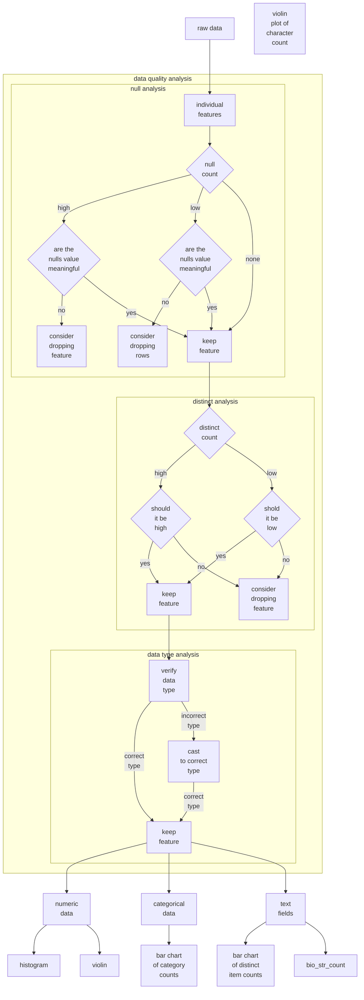

# reel-driver

A personal media curation algorithm trained on personally labeled data.

## Overview

Ever opened app after app on your SmartTV and you were greeted by a top row of squares of content you mostly weren't interested in? Well, if so, then this may be the repo you've been looking for. I've been repeatedly disappointed by content curation on the big streamers. Either they promote content I'm not interested in, I have to dig for content I do want, or it may display content to me, which only to discover after clicking on it, that I need another subscription or a purchase to access it.

The intention of this project is to create a model that ingests personalized training data in order to create a model that can run inferences on new media items and tell you whether or not you'd be into it! The data samples I have in the `/data` folder contain the training data and analysis results based off of my own preferences; but you could easily recreate the results but altering the label field for your preferences or feeding in your own data.   


## Project Structure

The project is structured into three main layers:

1. **Project Level** - The overarching configuration and coordination of all components
2. **Training Level** - The code for data processing and model training
3. **API Level** - The FastAPI service for serving model predictions


```
reel-driver/
├── app/                    # contains all API level contents
├── data/                   # Data files (not included in repo due to size)
│   ├── media.parquet
│   ├── binomial_classifier_training_data.parquet
│   ├── binomial_classifier_results.parquet
│   ├── false_positives.json
│   └── false_negatives.json
├── model_artifacts/        # Trained model files
│   ├── normalization.json  # Normalization parameters
│   └── xgb_model.json      # Trained XGBoost model
├── notebooks/              # Jupyter notebooks for analysis
│   └── binomial_classifier_analysis.ipynb
├── src/                    # Training code (see Training Level)
├── training.py             # Contains all training level contents
├── predict.py              # Test script for inference
├── .gitignore
├── README.md
├── requirements.in         # Input file for dependency management
└── requirements.txt        # Generated dependencies with pinned versions
```

## 1. Project Level

The project level coordinates the overall system and provides the structure for the entire project. Multiple items exists at the project level that are accessed by the training level and the API level. 

In addition to the project levels contains jupyter notebooks and model design documentation below that apply to the all API level and training level.

The project can be cloned at the project level and all modules are written to be accessible from the root level. The API and training levels mainly pertain once the project is deployed, as lower levels create container images via github workflows that will be used as part of the automatic-transmission ecosystem once built.

The documentation below all applies to the project level.

### Prerequisites

For the complete project:
- Python 3.12+
- PostgreSQL database with appropriate schema setup
- MLflow server (for model tracking)

### Environment Variables

Create a `.env` file in the root directory with the following variables:

```
PG_DB=your_database_name
PG_USER=your_database_user
PG_PASS=your_database_password
PG_HOST=your_database_host
PG_PORT=your_database_port
MLFLOW_HOST=your_mlflow_host
MLFLOW_PORT=your_mlflow_port
```

### Installation

This project uses `uv` for dependency management:

```bash
# Create and activate a virtual environment
python -m venv .venv

# On Windows
.venv\Scripts\activate
# On Unix or MacOS
source .venv/bin/activate

# Install dependencies using uv
uv pip install -r requirements.txt

# Regenerate requirements.txt upon requirements alteration
uv pip compile requirements.in -o requirements.txt
```

### experimental design

#### problem formulation

For the initial version of this model I am going with a binomial classifier, largely because that is the type of model that will best fit my current model training data. It would be interesting to potentially try a multi-class classification problem in the future. When discussing with my wife, we have considered labeling the data as one of these possibilities: `["would-not-watch", "would watch", "would watch multiple times"]` or something analogous. This would likely decrease the probability of getting false negatives on movies we would enjoy the most by giving them their own distinct class.

#### data discovery



#### algorithm selection

The primary model uses XGBoost for binary classification, as it handles complex feature interactions well and provides excellent performance with tabular data.

#### feature engineering

#### data splitting

#### model definition and hyperparameter grid

#### model training and tuning

#### model evaluation metrics   


## 2. Training Level

The training level is contained with the `./training` directory. The `./training` directory contains its own readme for deployment information.

## 3. API Level

The API level is contained with the `./app` directory. The `./app` directory contains its own readme for deployment information.